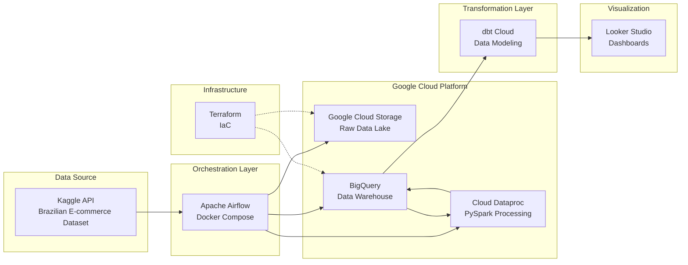
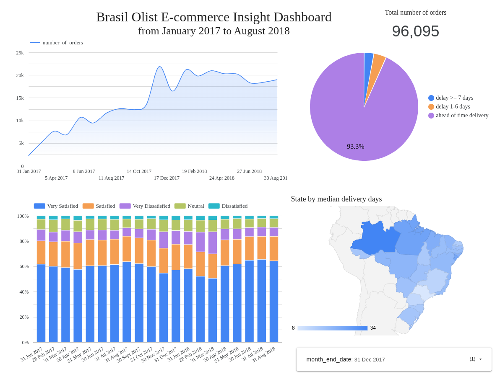

# Brazilian E-commerce Data Engineering Pipeline

## Overview

End-to-end data engineering pipeline processing the Olist Brazilian E-commerce dataset to generate business insights on monthly sales trends and the correlation between logistics latency and customer satisfaction.

The pipeline leverages Apache Airflow for orchestration, Google Cloud Platform for data storage and analytics (GCS, BigQuery, Dataproc), dbt for data transformation, and Looker Studio for visualization.


## Dataset information

This project utilizes the Brazilian E-commerce Public Dataset by Olist, available on [Kaggle](https://www.kaggle.com/datasets/olistbr/brazilian-ecommerce/data). The dataset contains information on orders made between 2016 and 2018 across multiple marketplaces in Brazil. It includes detailed data regarding order statuses, pricing, customer locations, product attributes, and customer reviews.

## Technologies

| Component | Technology |
|-----------|-----------|
| **Cloud Storage** | Google Cloud Storage (GCS) |
| **Orchestration** | Apache Airflow (Docker Compose) |
| **Containerization** | Docker & Docker Compose |
| **Data Warehouse** | Google BigQuery |
| **Compute** | Google Cloud Dataproc (PySpark) |
| **Transformation** | dbt Cloud |
| **Infrastructure** | Terraform |
| **Visualization** | Looker Studio |


## Pipeline Workflow

The pipeline follows **ELT (Extract, Load, Transform)** architecture:

1. **Infrastructure Setup**: Terraform (IaC) sets up the required infrastructure
2. **Extract & Load**: Airflow DAGs download datasets from Kaggle API and upload raw CSV files to **GCS**, then load into **BigQuery** tables
3. **Transform**: 
    * **dbt** transforms data into staging and fact/dimension models in **BigQuery**
    * **Dataproc (PySpark)** creates alternative analytics datasets in **BigQuery** (orchestrated by Airflow DAGs)
4. **Visualize**: **Looker Studio** dashboards display key business metrics (derived from dbt models)




## Project Structure

```bash
de_airflow_spark_project/
├── dags/                           # Airflow DAG definitions
│   ├── brazil_ecommerce_ingestion.py    # Data ingestion from Kaggle
│   ├── brazil_ecommerce_cumulative.py   # Dataproc PySpark jobs
│   ├── brazil_ecommerce_analysis.py     # Analysis workflows
│   ├── scripts/                         # PySpark job scripts
│   └── custom_sensors/                  # Custom Airflow sensors
├── dbt/                            # dbt project
│   ├── models/                          # Data models (staging, fact, dim)
│   ├── seeds/                           # Static datasets
│   ├── tests/                           # Data quality tests
│   └── macros/                          # Reusable SQL macros
├── terraform/                      # Infrastructure as Code
│   ├── main.tf                          # GCP resource definitions
│   └── variables.tf                     # Configuration variables
├── docker-compose.yaml             # Airflow local environment
├── Dockerfile                      # Custom Airflow image
├── requirements.txt                # Python dependencies
├── .env                            # Environment variables (add to .gitignore)
└── docs/                           # Documentation
    └── reproduce.md                     # Setup & deployment guide
```

## Getting Started

**Quick Launch**: See [docs/reproduce.md](./docs/reproduce.md) for setup and deployment instructions.


## Dashboard

Final insights are visualized in Looker Studio with interactive dashboards showing sales trends, customer satisfaction metrics, and logistics performance:



---

**License**: Olist Brazilian E-commerce dataset (Kaggle) — follow dataset terms and conditions