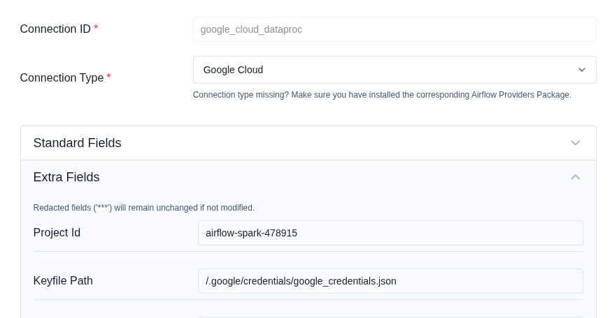
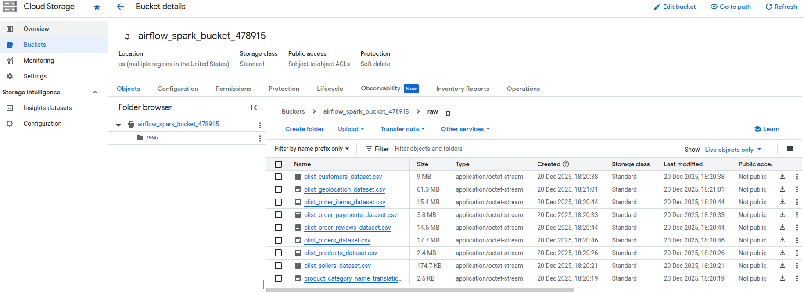
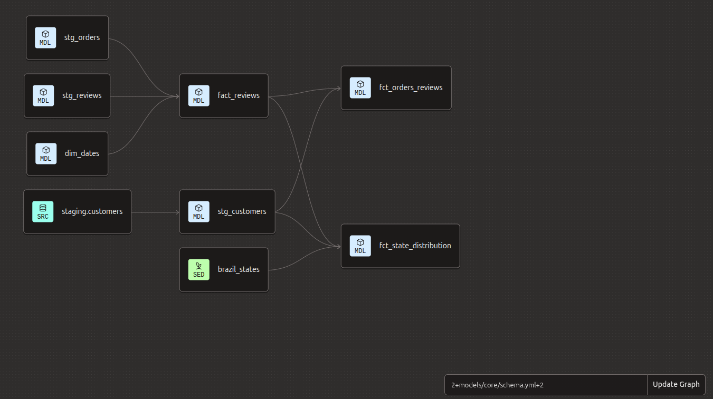

# Setup & Deployment Guide


## Prerequisites

- **Google Cloud Platform** account
- **Docker** and **Docker Compose** installed
- **Terraform** installed
- **dbt Cloud** account

## 1. GCP Setup

### Create GCP Project
1. Create a new project at [Google Cloud Console](https://console.cloud.google.com/)

### Create Service Account
1. Navigate to **IAM & Admin** -> **Service Accounts**
2. Create a new service account with the following roles:
   - **BigQuery Admin**
   - **Storage Admin**
   - **Dataproc Administrator**
   - **Compute Admin**
   - **BigQuery Data Editor**
   - **BigQuery Data Viewer**
   - **BigQuery Job User**
   - **Storage Object Viewer**
3. Generate and download JSON key
4. Save the key as `~/.google/credentials/google_credentials.json`

### Enable Required APIs
Navigate to [APIs & Services](https://console.cloud.google.com/apis/library) and enable:
- Cloud Storage API
- BigQuery API
- Dataproc API

## 2. Configure Environment Variables

Create a `.env` file in the project root (use [.env.example](.env.example) as template)

**Required Variables:**
- `AIRFLOW_UID`: User ID for Airflow containers (usually 50000)
- `GCP_CREDENTIALS`: Local path to GCP JSON key file
- `GCP_PROJECT_ID`: GCP project ID
- `GCP_PROJECT_REGION`: GCP region for resources (e.g., `europe-north1`, `us-central1`)
- `GCP_GCS_BUCKET`: Cloud Storage bucket name for raw data
- `GCP_BQ_DATASET`: BigQuery dataset name
- `GCP_CLUSTER_NAME`: Dataproc cluster name
- `GCP_TEMP_BUCKET`: Temporary GCS bucket for Dataproc job staging

## 3. Provision Infrastructure with Terraform

### Configure Terraform Variables

Navigate to the `terraform` directory and create a `terraform.tfvars` file:

```bash
cd terraform
cp terraform.tfvars.example terraform.tfvars
```

Edit `terraform.tfvars` with your actual values:

```hcl
project         = "your-project-id"
region          = "us-central1"              # Choose your preferred region
location        = "US"                       # US, EU, or specific region
gcs_bucket_name = "your-unique-bucket-name"
bq_dataset_name = "your-dataset-name"
```

### Deploy Infrastructure

```bash
terraform init
terraform plan
terraform apply
```

This creates:
- **GCS bucket** for raw data storage
- **BigQuery dataset** for data warehouse

**Cleanup** (when needed):
```bash
terraform destroy
```

## 4. Launch Airflow

### Build and Start Services

```bash
# Build Airflow image
docker compose build

# Initialize Airflow database & admin user
docker compose up airflow-init

# Start all services
docker compose up
```

### Access Airflow UI
- **URL**: http://localhost:8080
- **Username**: `airflow`
- **Password**: `airflow`

Add Dataproc connection 'google_cloud_dataproc' in Airflow UI as on the image below:


## 5. Setup dbt Cloud

1. Create account at [dbt Cloud](https://www.getdbt.com/)
2. Connect to BigQuery using your service account JSON key
3. Link to your dbt project repository
4. Follow [BigQuery setup guide](https://docs.getdbt.com/guides/bigquery)

## 6. Run the Pipeline

### Data Ingestion

1. In Airflow UI, locate `brazil_ecommerce_ingestion` DAG
2. Unpause the DAG
3. Trigger manually

**Expected result**: Raw CSV files uploaded to GCS and loaded into BigQuery raw tables




### Data Transformation with dbt

```bash
# Install dependencies
dbt deps

# Load seed data
dbt seed --select brazil_states

# Run all models
dbt run

# Run tests
dbt test

# Generate docs
dbt docs generate
```

Expected lineage:


### PySpark Processing (Optional)

For cumulative analysis, trigger `brazil_ecommerce_cumulative` and `brazil_ecommerce_analysis` DAGs which submit PySpark jobs to Dataproc.

## 7. Visualize in Looker Studio

1. Navigate to [Looker Studio](https://lookerstudio.google.com/)
2. Create new report
3. Connect to BigQuery dataset
4. Use transformed tables `fct_*` for analysis
